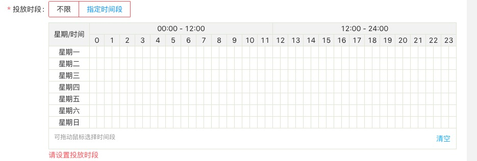
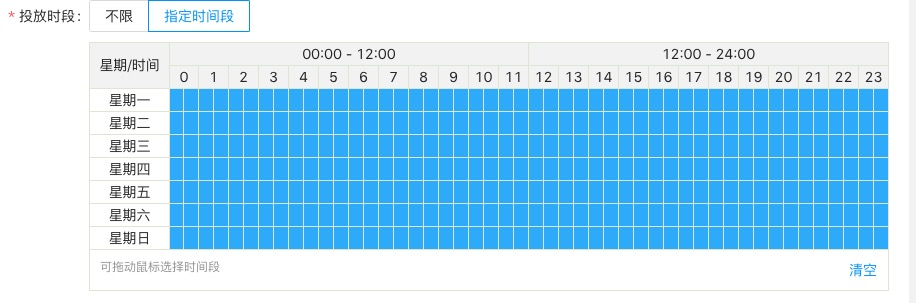

# ScheduleTable
一个用于设置7*24时段设置的表单组件，可用于原生、Vue、React等

由于现在开发的广告投放系统会使用到投放时段表单组件，感觉写一个还是挺麻烦的，
所以想如果别人有需要的话好把它整理下发出来，如果你正好有此需求，不想自己写的话，给我个issue
让我知道，然后我把它发不出来吧~

#### 组件长这样

#### 支持的功能
- 拖动鼠标选择/清除
- 设置默认值
- 获取设置值
- 值发生变化以后执行回调
- 清空